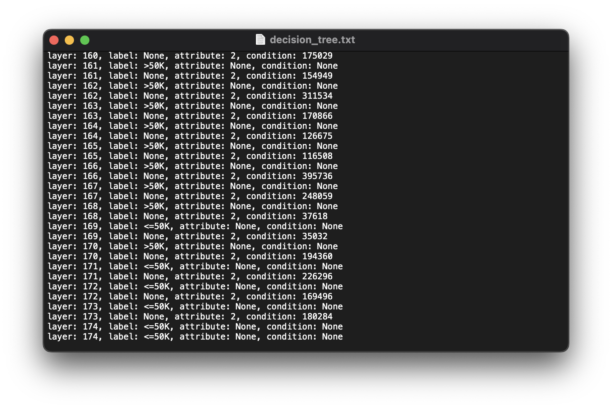
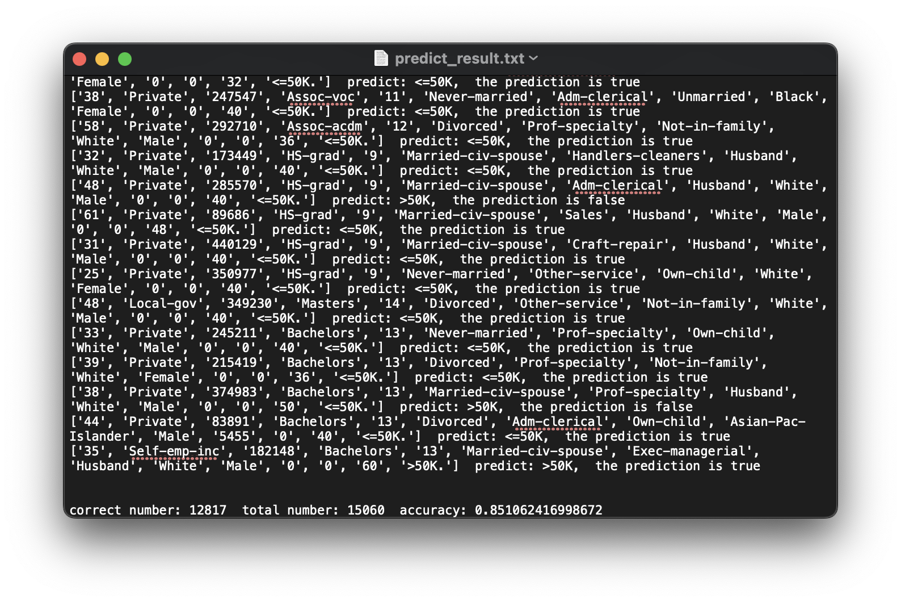

# Project Report

Hong Shengzhe  1155177751

Li Jingyue             1155177956

Yang Xiyu             1155178331

Xie Yimin              1155178717


[TOC]

## Introduction

In this project, we aim to solve the decision tree classification problem through the implementation of Hung algorithm. Specifically, we generate a decision tree based on the training set, and then predict whether the person's annual income can reach 50K from the record in the evaluation set.

In general, our program can be divided into two parts. One part is the generation of decision tree and the other part is the prediction of the test set record. Therefore, our report will present the implementation process of these two parts and the obtained results separately.


## Generation of Decision Tree

In our program, the part that builds the decision tree includes these functions. And each function has its description in the source code, which is not repeated here.

- `load_dataset`
- `calc_gini`
- `split_dataset`
- `hunt`
- `print_tree`


### Structure of the Decision Tree

In order to be able to generate a tree structure, we first need to define the structure of the nodes in the tree. We define the node structure using python's class method definition, the code of which is shown below. Each node consists of five attributes.

```python
class node:
    def __init__(self, left_node=None, right_node=None, attribute=None, label=None, condition=None):
        self.left_node = left_node  # left node
        self.right_node = right_node  # right node
        self.attribute = attribute  # the split attribute
        self.label = label  # the predicate label
        self.condition = condition  # the split condition
```


### Prepossessing

As required, we need to preprocess the dataset first. This is done by using the `load_dataset` function, which reads the data sequentially from the input file path and removes the records with '? records and the "native-country" attribute. The final preprocessed record has 13 attributes and a label.

```python
def load_dataset(filename):
    fr = open(filename)
    dataset = []
    label = []
    for line in fr.readlines():
        cutline = line.strip().split(', ')
        # Remove all the records containing '?'
        if '?' not in cutline and cutline != ['']:
            # remove the attribute "native-country"
            dataset.append(cutline[:-2] + cutline[-1:])
    return dataset
```


### Hunt Algorithm

The `Hunt Algorithm` builds decision trees recursively by successively dividing the training records into purer subsets, and is the basis for many decision tree algorithms.

After defining the data structure, the next step is to use the training set data to generate the decision tree. The core function is `hunt()`, which, as the name implies, uses the idea of `Hunt Algorithm` to generate decision tree. This is the pseudo-code representation of hunts from the lecture notes.

```
algorithm Hunt(S)
/* S is the training set; the function returns the root of a decision tree */
1. if all the objects in S belong to the same class
2. 		return a leaf node with the value of this class
3. if (all the objects in S have the same attribute values)
	 or (|S| is too small)
4. 		return a leaf node whose class value is the majority one in S
5. find the “best” split attribute A∗ and predicate P∗
6. S1 ← the set of objects in R satisfying P∗; S2 ← S \ S1
7. u1 ← Hunt(R1); u2 ← Hunt(R2)
8. create a root u with left child u1 and right child u2
9. set Au ← A∗ and Pu ← P∗
10. return u
```

In our program, to avoid overfitting, the threshold value set for the current dataset size is 300. i.e., when the current dataset size is smaller than 300, then return a leaf node whose class value is the majority one in current dataset.

We are finding the best split point by calculating the Gini. This is done through the `calc_gini` function. We calculate all the attributes and all the attribute values of the current dataset and find the attribute and attribute value with the smallest Gini, which is the best splitting point. It is important to note that there are two types of attributes in the dataset, ordinal and nominal, and they need to be treated separately. After viewing the attribute information of the dataset, we distinguish whether the attribute is discrete or continuous by determining whether the attribute value is integer data.


> For an ordinal attribute A, a candidate split is a condition of the form A ≤ v, where v is a value of A appearing in S such that S has at least one object satisfying the condition and at least one object that does not. 
>
> For a nominal attribute A, a candidate split is a condition of the form A ∈ S, where S is a subset of the values of A appearing in S such that S has at least one object satisfying the condition and at least one object that does not.

According to the description of the two types of candidate split in the lecture note, the subset that matches the split point condition is treated as the left subset and the data that does not match the condition is treated as the right subset in our `split_dataset` function.


### Decision Tree Obtained

After the `hunt` function is finished, the root node of the decision tree is returned. The `print_tree` function will output the decision tree to the `decision_tree.txt` file in a level order traversal. Due to its length, the complete tree can be viewed in the `decision_tree.txt` file, so only a partial screenshot is shown here.



 The node is not a leaf node, if the `label` value of this node in the decision tree is `None`. It is necessary to decide whether to continue traversing the left or right subtree based on `attribute` and `condition` before encountering a leaf node. 


## Predict the Records

We use the `predict` function to predict the `label` of the input record. That is, for all the data in the test set, each data is fed into the generated decision tree in turn, until it is traversed to a leaf node.  The `label` value of this node is the prediction result of the current input data, and the success of the prediction is determined by comparing the predicted value with the label value of the data itself.

Throughout the prediction process, we count the total number of input record and the total number of correct predictions to know the accuracy of this decision tree. The total number of input record was 15060, and we successfully predicted 12817 records by decision tree with an accuracy of about 0.851.



We finally output the contents of all the test record and the prediction results of the decision tree to the `predict_result.txt` file. The file is too large and the complete content can be viewed in the file above. Only part of the content is shown here.